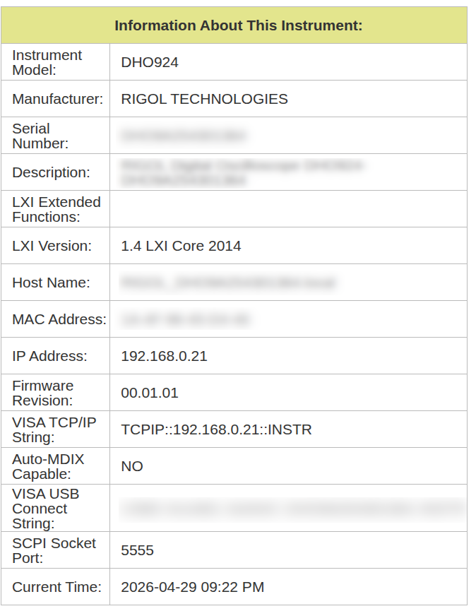

# rpi-stm32-testbench

An automated Hardware-in-the-Loop (HIL) test bench for the STM32F103 MCU. This project integrates a Raspberry Pi controller and an oscilloscope for automated firmware validation.


## System Architecture

The test bench consists of the following components:

1.  **Controller:** Raspberry Pi (or PC) running Python-based test scripts.
2.  **Programmer/Debugger:** ST-Link V2 connected via USB to the controller.
3.  **Target MCU:** STM32F103 MCU (e.g., Blue Pill) connected to the ST-Link V2.
4.  **Measurement:** Rigol DHO924 Digital Oscilloscope (LXI-compatible) probing the STM32F103 for real-time verification.

### Hardware Connections

- **Programming:** ST-Link V2 connected to STM32F103 SWD pins (SWDIO, SWCLK, GND, 3.3V).
- **Measurement:** Oscilloscope Channel 1 probe connected to **GPIOA12** on the STM32F103.
- **Networking:** Controller and Oscilloscope must be on the same network for SCPI communication.

## Software Requirements

### Firmware Development
- **Toolchain:** `arm-none-eabi-gcc`
- **Libraries:** `libopencm3`, `FreeRTOS` (included in `firmware/stm32f1/lib`)
- **Flashing Tool:** `st-flash` (from the `stlink` tools)

### Testing Environment
- **Python:** 3.x
- **Packages:** `pytest`, `pyvisa`, `pyvisa-py` (see `tests/requirements.txt`)
- **Backend:** `python-vxi11` or `zeroconf` (for PyVISA-py)

## Getting Started

### 1. Build the Firmware

Navigate to the firmware directory and run make:

```bash
cd firmware/stm32f1
make
```

To flash manually:
```bash
make flash
```

### 2. Configure the Test Environment

Your oscilloscope should have LXI/SCPI settings similar to those shown in the image below (e.g., LXI enabled, SCPI port 5555).



Update the `SCOPE_IP_ADDRESS` in `tests/scope_utils.py` and `tests/square_wave_test.py` to match your oscilloscope's IP.

Install Python dependencies:
```bash
cd tests
pip install -r requirements.txt
```

### 3. Run Automated Tests

The tests will automatically flash the MCU with test binaries and verify the output using the oscilloscope.

```bash
cd tests
pytest
```

## Project Structure

- `firmware/stm32f1/`: STM32 source code, FreeRTOS config, and Makefiles.
- `tests/`: Python test suite and oscilloscope utility scripts.
- `tests/bins/`: Pre-compiled binaries for specific test cases (e.g., different square wave frequencies).

## Authors

*   **Jordan Huus**
